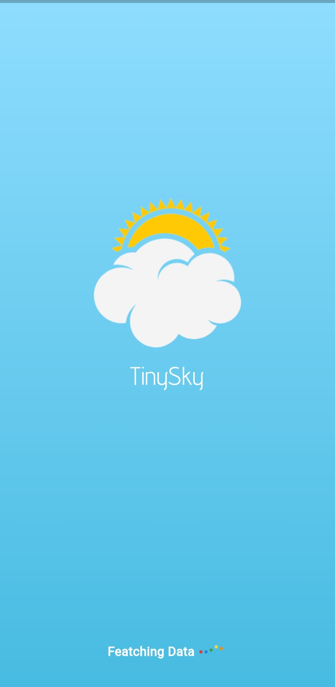

# TinySky Weather App

TinySky is a weather application that provides accurate weather forecasts based on your device's location. It allows users to access real-time weather information, hourly forecasts, and a delightful UI experience.

## Screenshots

  
  
  
  

## Features

- **Location-based Weather**: Automatically fetches the user's location to display accurate weather details.
- **Hourly Forecast**: Provides detailed hourly weather forecasts to help plan your day effectively.
- **OpenWeatherMap API**: Utilizes the OpenWeatherMap API to retrieve weather data for precise predictions.
- **Light and Dark Themes**: Offers both light and dark themes for a comfortable user experience.
- **Lottie Animations**: Uses Lottie animations to depict weather conditions with engaging visual elements.

## Technologies Used

- **Geolocator**: Fetches the device's location information for accurate weather data.
- **OpenWeatherMap API**: Accesses real-time weather data to provide forecasts.
- **Lottie Animations**: Integrates animated weather visuals for an engaging UI experience.

## Permissions

The app requires location permission to fetch accurate weather information based on your current location. It ensures precise weather forecasts tailored to your area.

## How to Use

1. **Location Access**: Upon launching the app, it will request permission to access your device's location.
2. **Weather Details**: View current weather conditions, hourly forecasts, and other weather-related information.
3. **Theme Selection**: Choose between light and dark themes for a personalized experience.

## Installation

- **Clone the Repository**: Clone the repository to your local machine.
- **Set Up Dependencies**: Make sure to have necessary dependencies installed, such as Geolocator and Lottie.
- **Run the App**: Launch the app on an emulator or a physical device.

## Contributing

Contributions to TinySky are welcome! Feel free to submit issues or pull requests to improve the app.

## Support

For any queries or support, please contact [am3718440@gmail.com]{'am3718440@gmail.com'}.
